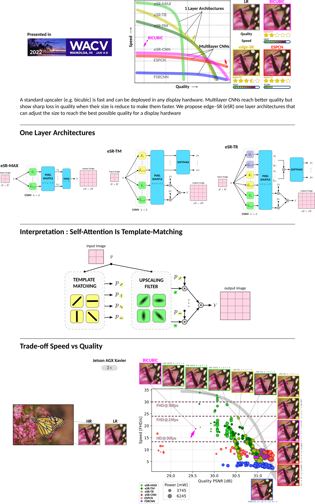

## edge-SR: Super Resolution For The Masses
<p align="center">
    
</p>

### Citation

[Pablo Navarrete Michelini, Yunhua Lu and Xingqun Jiang. "edge-SR: Super-Resolution For The Masses", in IEEE Winter conference on Applications of Computer Vision (WACV), 2022.](https://www.researchgate.net/publication/354115710_edge-SR_Super-Resolution_For_The_Masses)

#### BibTeX
    @inproceedings{eSR,
        title     = {edge--{SR}: Super--Resolution For The Masses},
        author    = {Navarrete~Michelini, Pablo and Lu, Yunhua and Jiang, Xingqun},
        booktitle = {Proceedings of the {IEEE/CVF} Winter Conference on Applications of Computer Vision ({WACV})},
        month     = {January},
        year      = {2022},
        pages     = {1078--1087},
        url       = {https://arxiv.org/abs/2108.10335}
    }

### Instructions:
- Place input images in `input` directory (provided as empty directory). Color images will be converted to grayscale.

- To upscale images run: `python run.py`.

  Output images will come out in `output` directory.

- The GPU number and model file can be changed in run.py (in comment "CHANGE HERE").

### Requirements:
- Python 3, PyTorch, NumPy, Pillow, OpenCV

### Experiment results
- The `data` directory contains the file `tests.pkl` that has the Python dictionary with all our test results on different devices. The following sample code shows how to read the file:

```python
>>> import pickle
>>> test = pickle.load(open('tests.pkl', 'rb'))
>>> test['Bicubic_s2']
    {'psnr_Set5': 33.72849620514912,
     'ssim_Set5': 0.9283912810369976,
     'lpips_Set5': 0.14221979230642318,
     'psnr_Set14': 30.286027790636204,
     'ssim_Set14': 0.8694934108301432,
     'lpips_Set14': 0.19383049915943826,
     'psnr_BSDS100': 29.571233006609656,
     'ssim_BSDS100': 0.8418117904964167,
     'lpips_BSDS100': 0.26246454380452633,
     'psnr_Urban100': 26.89378248655882,
     'ssim_Urban100': 0.8407461069831571,
     'lpips_Urban100': 0.21186692919582129,
     'psnr_Manga109': 30.850672809780587,
     'ssim_Manga109': 0.9340133711400112,
     'lpips_Manga109': 0.102985977955641,
     'parameters': 104,
     'speed_AGX': 18.72132628065749,
     'power_AGX': 1550,
     'speed_MaxQ': 632.5429857814075,
     'power_MaxQ': 50,
     'temperature_MaxQ': 76,
     'memory_MaxQ': 2961,
     'speed_RPI': 11.361346064182795,
     'usage_RPI': 372.8714285714285}
```

The keys of the dictionary identify the name of each model and its hyper--parameters using the following format:

- `Bicubic_s#`,
- `eSR-MAX_s#_K#_C#`,
- `eSR-TM_s#_K#_C#`,
- `eSR-TR_s#_K#_C#`,
- `eSR-CNN_s#_C#_D#_S#`,
- `ESPCN_s#_D#_S#`, or
- `FSRCNN_s#_D#_S#_M#`,

where `#` represents an integer number with the value of the correspondent hyper-parameter. For each model the data of the dictionary contains a second dictionary with the information displayed above. This includes: number of model parameters; image quality metrics PSNR, SSIM and LPIPS measured in 5 different datasets; as well as power, speed, CPU usage, temperature and memory usage for devices `AGX` (Jetson AGX Xavier), `MaxQ` (GTX 1080 MaxQ) and `RPI` (Raspberry Pi 400).

